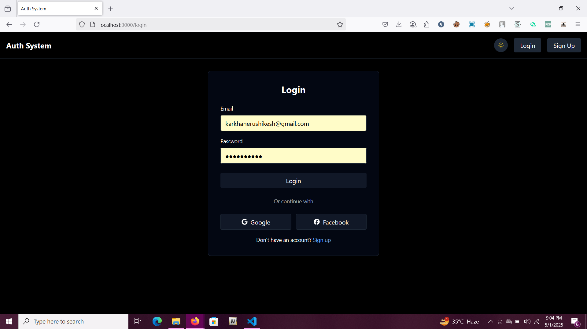
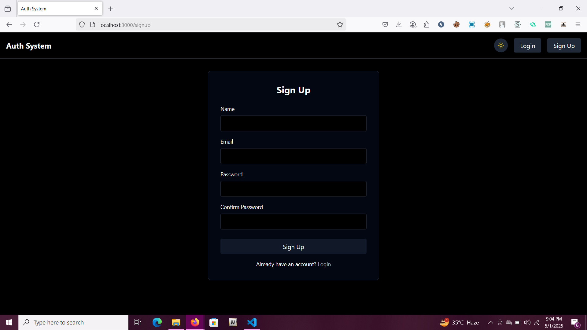
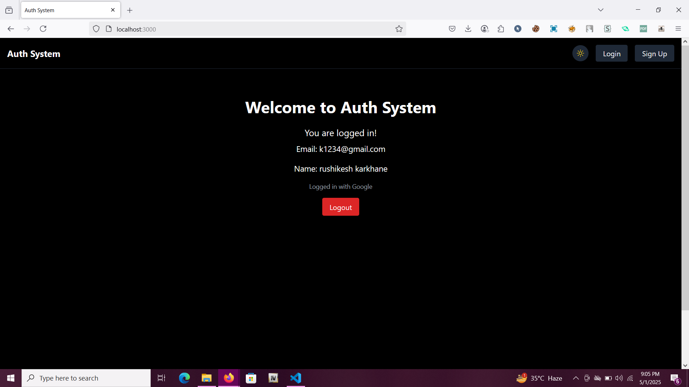
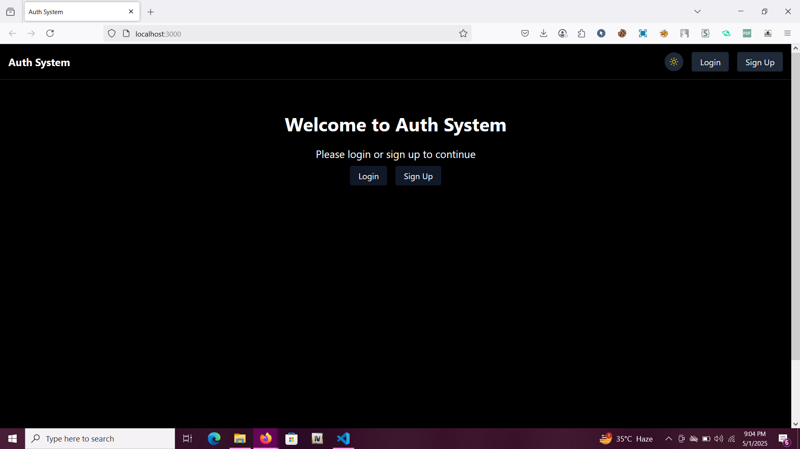

# 🔐 MERN Auth System – Email, Google & Facebook Authentication

A  **authentication system built with the MERN stack (MongoDB, Express, React, Node.js)** supporting:

- 🔑 Email/Password Signup & Login
- 🌐 Google Login (OAuth2)
- 📘 Facebook Login (OAuth2)
- 🛡 JWT-based token authentication
- 🧠 Passport.js strategy integration

## ✨ Features

- User Sign Up & Log In using Email/Password
- Social login via Google and Facebook
- Secure password storage with bcrypt
- JWT-based session handling
- Ready-to-use frontend in React
- Reusable backend structure with Passport strategies

## 🧱 Tech Stack

**Frontend:**
- React
- Axios
- React Router
- Talwind Css

**Backend:**
- Node.js
- Express.js
- Passport.js (Local, Google, Facebook strategies)
- JSON Web Token (JWT)
- bcrypt for password hashing

**Database:**
- MongoDB 

**Installation:**
  clone the repository

```
git clone https://github.com/rushikesh4221/MERN-Auth-System-Email-Google-Facebook-Authentication
```

Install Backend Dependencies

```
cd backend
npm install
```

Install Frontend Dependencies

```
cd frontend
npm install
```

Start the Frontend

```
npm start
```

create a .env file in backend with
```
PORT=5000
MONGODB_URI=your mongo url
JWT_SECRET=your jwt secret
JWT_EXPIRE=30d
GOOGLE_CLIENT_ID=get it from official site
GOOGLE_CLIENT_SECRET=get it from official site
FACEBOOK_APP_ID=get it from official site
FACEBOOK_APP_SECRET=get it from official site
FRONTEND_URL=http://localhost:3000
```
Start the Backend Open a **new terminal**, then:

```
cd backend
node server.js
```
**Screenshots:**





**keywords:**
mern authentication system,
mern stack login signup,
mern google facebook login,
mern google login,
mern facebook login,
react nodejs authentication,
mern auth with jwt,
mern login register tutorial,
mern oauth authentication,
mern auth boilerplate,
passport jwt mern,
fullstack auth system mern,
mern project with login signup,
jwt authentication in mern,
social login in react node,
google facebook login react,
mern auth template github,
node.js authentication system,
mern login system open source,
mern user auth full stack,
login with google in mern,
login with facebook in mern,
react login system with backend,
secure login system react node,
MERN auth template,
MERN authentication starter,
React authentication boilerplate,
Full stack authentication template MERN,
MERN authentication course,
React authentication tutorial for beginners,
Node.js authentication guide,
JWT authentication React Node,
Passport.js MERN authentication,
OAuth 2.0 MERN stack,
React authentication,
Node.js authentication,
Full stack authentication,
User authentication,
Registration system,
MERN stack user authentication tutorial,
MERN authentication with JWT tutorial,
Implement Google login in MERN stack,
Add Facebook login to MERN application,
Secure MERN authentication with JWT,
MERN login and registration example,
Full stack React Node authentication with JWT,
MERN authentication boilerplate with social login,
Passport JWT authentication in MERN stack,
React Node.js authentication best practices,
Build a secure login system with MERN,
Open source MERN login system,
React login system with Node.js backend and JWT,
MERN authentication using Google OAuth 2.0,
MERN authentication using Facebook OAuth,
MERN stack authentication example GitHub,
Node.js authentication system with React frontend,
Secure API authentication in MERN stack,
Role-based authentication in MERN stack,

